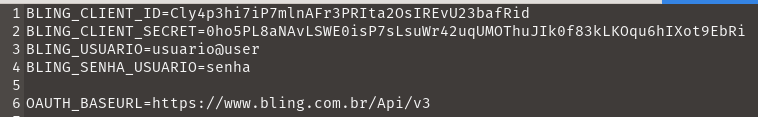
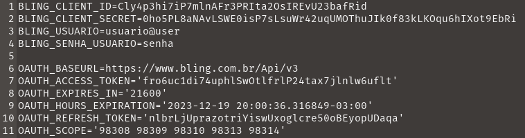

# Bling API V3 OAuth


Script desenvolvido para facilitar a obtenção do Access Token da API V3 do Bling e sua atualização com o Refresh Token. Módulo para abstrair essa parte e trazer agilidade no desenvolvimento do seu software.

## 💻 Pré-requisitos

Antes de começar, verifique se você atendeu aos seguintes requisitos:

- Ter o [Git configurado](https://docs.github.com/pt/get-started/quickstart/set-up-git).
- Tem tem [python3](https://www.python.org/downloads/) instalado.
- Possui algum gerenciador de **ambiente virtual python** como: [conda](https://conda.io/projects/conda/en/latest/user-guide/index.html) ou [venv](https://docs.python.org/pt-br/3/library/venv.html)
- Você tem uma máquina `<Windows / Linux / Mac>`.
- Você leu [documentação Bling API V3](https://developer.bling.com.br/).

## 🎉 Começando

Para instalar o **bling_api_v3_oauth**, siga estas etapas:

<details>
<summary><b> 1° Clone o projeto e entre no diretório do projeto</b></summary>

1. **Clone o projeto.** Abra o seu terminal e digite:
    
    ~~~bash
    git clone https://github.com/vcsil/bling_api_v3_oauth.git
    ~~~
    
2. Entre no diretório do projeto:
    
    ```bash
    cd bling_api_v3_oauth
    ```
</details>

Configure um ambiente virtual e as dependências com [conda](https://conda.io/projects/conda/en/latest/user-guide/index.html) ou [venv](https://docs.python.org/pt-br/3/library/venv.html)

<details>
<summary><b>2° Crie um ambiente virtual com</b> <a href="https://conda.io/projects/conda/en/latest/user-guide/index.html" target="_blank">conda</a><b> e instale as dependências</b></summary>

É necessário ter [conda](https://docs.conda.io/projects/conda/en/latest/user-guide/install/download.html) previamente instalado.

1. Crie um ambiente virtual com **conda** e **instale** as dependências dos projetos.
    
    ~~~bash
    conda create -n bling_oauth --file environment.txt -y
    ~~~
    
    Note que o nome do ambiente virtual criado é “bling_oauth”
    
    A flag `-y` no final permite a instalação automática dos pacotes, remova caso queria acompanhar quais serão instalados.
    
2. Ative o ambiente virtual criado
    
    ```bash
    conda activate bling_oauth
    ```
    
3. Você verá o nome do ambiente virtual no seu prompt de comando, indicando que o ambiente está ativo. Exemplo:
    
    ```bash
    (bling_oauth) $
    ```
</details>

<details>
<summary><b>2° Crie um ambiente virtual com </b><a href="https://docs.python.org/pt-br/3/library/venv.html" target="_blank">venv</a><b> e instale as dependências</b></summary>

1. Crie um ambiente virtual com venv.
    
    ```bash
    python3 -m venv bling_oauth
    ```
    
    Note que o nome do ambiente virtual criado é “bling_oauth”
    
2. Ative o ambiente virtual criado
    
    ```bash
    # No Linux/Mac:
    source bling_oauth/bin/activate  
    
    # No Windows (PowerShell):
    .\bling_oauth\Scripts\Activate
    # No Windows (cmd):
    .\bling_oauth\Scripts\activate.bat
    ```
    
3. Você verá o nome do ambiente virtual no seu prompt de comando, indicando que o ambiente está ativo. **Exemplo**:
    
    ```bash
    (bling_oauth) $
    ```
    
4. Instale as dependências necessárias.
    
    ```bash
    pip install -r requirements.txt
    ```
</details>

<details>
<summary><b> 3° Configure as variáveis de ambientes necessárias</b></summary>

1. Faça uma cópia do arquivo `.env.example` e crie o `.env` que será usado 
    
    ```bash
    # No Linux/Mac:
    cp ./.env.example ./.env
    
    # No Windows (PowerShell):
    Copy-Item -Path "./.env.example" -Destination "./.env"
    
    # No Windows (cmd)
    copy ./.env.example ./.env
    ```
    
2. Abra o arquivo `.env` com o seu editor de texto preferido e forneça as credenciais
    - `BLING_CLIENT_ID`: fornecido na página do aplicativo no Bling
    - `BLING_CLIENT_SECRET`: fornecido na página do aplicativo no Bling
        
        ](images/CredentialsBling.png)
        
        [Acesse a documentação da API BLING V3](https://developer.bling.com.br/aplicativos#visualiza%C3%A7%C3%A3o)
        
    - `BLING_USUARIO`: Usuário do bling para liberar acesso as informações necessárias da conta. Utilizado para fazer o login com a autentificação OAuth e gerar as credenciais. Verifique sempre o escopo da aplicação.
    - `BLING_SENHA_USUARIO`: Senha do usuário
    
    > [!WARNING]\
    > Nunca compartilhe os dados contido no .env
    
    **Exemplo de `.env` preenchido**
    
    
    </details>

## **☕ Usando bling_api_v3_oauth**

Após fazer toda a instalação do projeto e configurar as variáveis de ambiente. 

- Execute o seguinte comando na raiz do projeto para gerar **novas credenciais** dentro do arquivo `.env`
    
    ```bash
    python3 BlingV3.py
    # ou 
    python3 BlingV3.py create
    ```
    
    O script ira se autenticar automaticamente e ira preencher o arquivo `.env` com as credenciais criadas.
    
    Não feche as jenelas que abrirem
    
    **Exemplo de `.env` após gerar as credenciais:**
    
    
    
- Execute o seguinte comando raiz do projeto para gerar **atualizar as credenciais** dentro do arquivo `.env`
    
    ```bash
    python3 BlingV3.py refresh
    ```
    
    O script ira se autenticar automaticamente e ira atualizar o arquivo `.env` com as credenciais criadas.

## 📫 Contribuindo para bling_api_v3_oauth

Para contribuir com <nome_do_projeto>, siga estas etapas:

1. Bifurque este repositório.
2. Crie um branch: `git checkout -b <nome_branch>`.
3. Faça suas alterações e confirme-as: `git commit -m '<mensagem_commit>'`
4. Envie para o branch original: `git push origin bling_api_v3_oauth / <local>`
5. Crie a solicitação de pull.

Como alternativa, consulte a documentação do GitHub em [como criar uma solicitação pull](https://help.github.com/en/github/collaborating-with-issues-and-pull-requests/creating-a-pull-request).

## 🤝 Colaboradores

Agradecemos às seguintes pessoas que contribuíram para este projeto:

<table>
  <tr>
    <td align="center">
      <a href="https://github.com/MatheusBruno" title="foto de MatheusBruno">
        <br>
        <sub>
          <b>MatheusBruno</b>
        </sub>
      </a>
    </td>
    <td align="center">
      <a href="https://github.com/vcsil" title="foto de vcsil">
        <br>
        <sub>
          <b>vcsil</b>
        </sub>
      </a>
    </td>
  </tr>
</table>